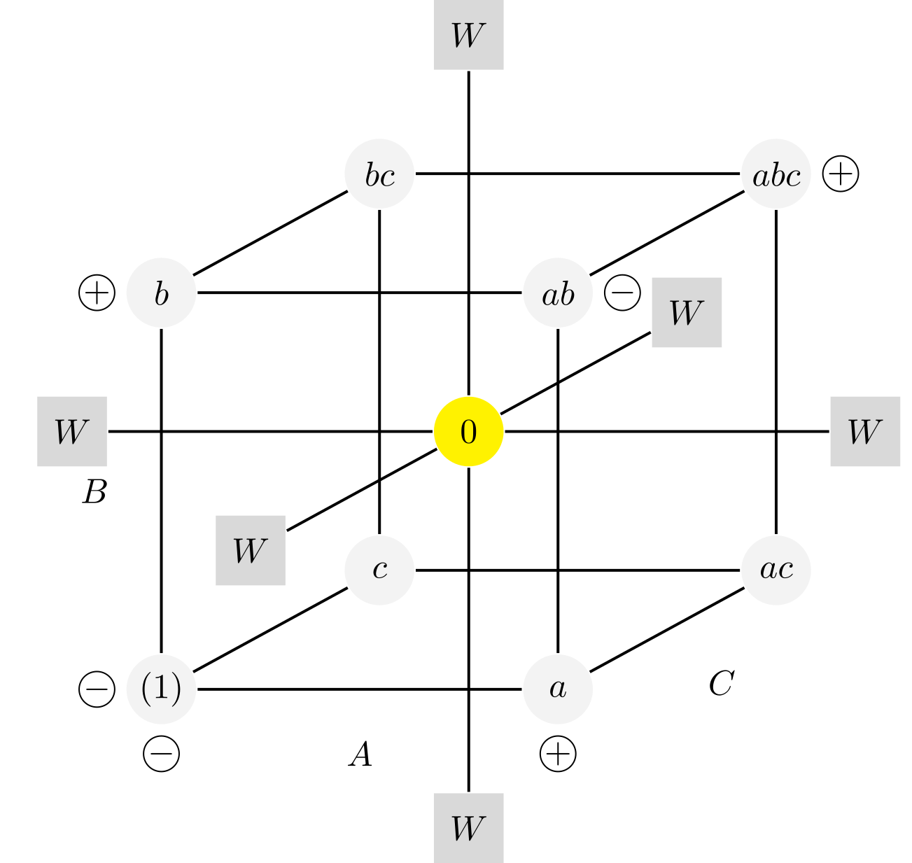

# Fokus nulis, jangan fokus dekor! 
{: .fs-9 }

Lebih dari setengah waktu yang Anda gunakan untuk menulis habis hanya untuk mengurus posisi gambar yang harusnya rata tengah tapi gak pernah kelihatan *di tengah*. 
{: .fs-6 .fw-300 }

---

Bayangkan Anda sedang menulis tesis dan *deadline* sudah sehari lagi. Tesis Anda tebal. Data visualnya banyak. Geser gambar sedikit, semua hancur lebur. Kalau sudah begitu, setengah hari bakal habis untuk ngecek satu-satu halamannya. Belum lagi nanti kalau ada revisi mendatang.

Pernah mikir gimana buku ajar yang sebegitu tebalnya disusun? Dokumen sekelas tugas kuliah tapi mau rapi seperti diterbitin di penerbitan mahal? Masukin satu rumus di Word makan waktu 3 menit? Belum lagi masukin visualisasi/tabel? Gambar diagram di Word kesannya kelihatan murah? Kampus/penerbit ngewajibin pakai LaTeX tapi gak ada waktu buat belajar?

**Coba deh kontak saya.**

## Kenapa LaTeX?

LaTeX adalah salah satu bahasa markah (*markup language*). Dulunya, TeX dibuat karena Donald Knuth, *programmer* TeX, kecewa berat karena papernya dicetak ulang tidak lagi pakai mesin cetak cap, melainkan dengan sistem afdruk *offset* yang pakai komputer. Mesin afdruk tadi dinilai jelek karena tidak mendukung layout dan susunan yang kompleks (misalnya rumus-rumus matematis). Hal itu beda dengan menyusun posisi huruf dengan tangan di mesin cetak cap.

Di zaman sekarang, problemnya adalah Word (dan kebanyakan *word processor* lain) mirip seperti problemnya Knuth. Word memang mudah, tapi berapa lama waktu untuk membuat figur sebagai berikut (dan masih banyak lagi).

{: .mx-auto }

{: .mx-auto }

# Saya gak perlu rumus, apa saya perlu LaTeX?

Dokumen Anda tidak perlu rumus dan figur njelimet, jadi apa perlunya LateX buat Anda? Seperti yang saya bilang di awal, LaTeX membuat dokumen Anda rapi. Kalau lihat buku ajar mahal, semua pakai LaTeX. Bayangkan Anda menyusun dokumen kamus setebal itu menggunakan, misalnya, program *layout* seperti Adobe InDesign, lebih-lebih lagi kalau pakai Word. Semuanya tumbang.

Kalau Anda perlu hemat waktu, selagi saya kerjakan dokumen Anda, anda bisa lakukan hal lain. **Hemat waktu Anda!**
